# Invention Disclosure Form B (IDFB)

---

## 1. Title of the Invention

**AI-Based Cryptocurrency Fraud Detection System Using Hybrid Multi-Model Architecture with Reinforcement Learning and Federated Learning**

---

## 2. Field / Area of Invention

- Artificial Intelligence & Machine Learning  
- Blockchain Security & Cryptocurrency Transaction Monitoring  
- Financial Fraud Detection Systems  
- Distributed / Privacy-Preserving Machine Learning  

---

## 3. Prior Art and Publications from Literature

| # | Reference | Approach | Limitations |
|---|-----------|----------|-------------|
| 1 | Weber et al., KDD 2019 | Graph Convolutional Networks for bitcoin transaction classification | Single-model approach; no temporal or behavioural analysis |
| 2 | Alarab et al., IEEE Access 2020 | LSTM-based sequence modelling for blockchain fraud | No graph topology; ignores network structure of transactions |
| 3 | Pham & Lee, ACM SIGKDD 2016 | Random Forest / Gradient Boosting on handcrafted features | Static threshold; no adaptive regime detection |
| 4 | Lorenz et al., Financial Cryptography 2020 | Supervised classifiers with engineered features | Centralized only; no privacy-preserving training |
| 5 | Chen et al., IEEE TKDE 2021 | Anomaly detection using isolation forests on crypto data | Unsupervised only; high false-positive rate |
| 6 | Hu et al., WWW 2019 | Graph attention networks for transaction fraud | No explainability; black-box predictions |
| 7 | Poursafaei et al., NeurIPS 2022 | Temporal graph networks for evolving transaction patterns | Requires full graph access; not privacy-preserving |
| 8 | Li et al., IEEE TDSC 2022 | Federated learning for financial fraud detection | No reinforcement learning; limited model diversity |

---

## 4. Summary and Background of the Invention

### Problem Statement

Cryptocurrency fraud detection faces several critical challenges:

1. **Single-model dependency** — Existing approaches rely on one classification technique (e.g., only GNN or only Random Forest), failing to capture the multi-faceted nature of fraudulent behaviour that spans feature statistics, temporal patterns, and graph topology.

2. **Static decision thresholds** — Conventional systems apply fixed classification thresholds regardless of market conditions (bull, bear, or volatile regimes), leading to degraded performance under changing market dynamics.

3. **No behavioural profiling** — Current methods do not construct behavioural fingerprints of transaction entities, missing recurring fraud patterns that operate across time windows.

4. **Lack of explainability** — Most deep-learning-based detectors act as black boxes, providing no actionable insight to compliance analysts about why a transaction was flagged.

5. **Privacy concerns** — Centralized training requires pooling sensitive transaction data from multiple exchanges into a single server, violating data-sovereignty and regulatory constraints.

6. **Absence of adaptive policy learning** — No existing system uses reinforcement learning to dynamically learn an optimal fraud-flagging policy that balances detection accuracy against false-alarm costs.

### Gap Addressed

This invention bridges all six gaps through a unified, modular architecture that integrates ten distinct technical contributions into a single end-to-end pipeline — from data ingestion through explainable risk scoring to privacy-preserving distributed training.

---

## 5. Objectives of the Invention

1. Develop a **hybrid multi-model risk scoring engine** that fuses predictions from Random Forest, XGBoost, Isolation Forest, LSTM, and GNN models with dynamic weighting.

2. Detect **temporal fraud patterns** using LSTM-based sequence modelling over transaction time-series windows.

3. Classify transactions using **Graph Neural Networks (GCN)** that leverage the directed payment-flow topology of blockchain networks.

4. Identify anomalies through **statistical feature analysis** comparing illicit vs. licit transaction distributions across all feature dimensions.

5. Construct **behavioural fingerprints** using Gaussian Mixture Models (GMM) to cluster transaction entities into behavioural archetypes.

6. Implement **adaptive threshold classification** using Hidden Markov Model (HMM)-based market regime detection that automatically adjusts decision boundaries under bull, bear, and volatile market conditions.

7. Provide **explainable fraud decisions** using SHAP (SHapley Additive exPlanations) so analysts can understand which features contributed to each fraud flag.

8. Train a **Deep Q-Network (DQN) reinforcement learning agent** that learns an optimal fraud-flagging policy by maximizing a reward function that penalizes missed frauds more heavily than false alarms.

9. Enable **privacy-preserving distributed training** through Federated Averaging (FedAvg) across multiple simulated exchange nodes, ensuring raw transaction data never leaves its origin.

10. Produce **publication-quality visualizations** for every stage of the pipeline to support audit, compliance, and research dissemination.

---

## 6. Working Principle of the Invention (Brief)

The system operates through a **multi-stage pipeline**:

```
Raw Transactions ──► Preprocessing & Feature Engineering (178 features)
        │
        ├──► Random Forest Classifier ─────────────────────────┐
        ├──► XGBoost Classifier ───────────────────────────────┤
        ├──► Isolation Forest (Unsupervised Anomaly) ──────────┤
        ├──► LSTM Temporal Sequence Model ─────────────────────┤
        ├──► GCN Graph Neural Network ─────────────────────────┤
        │                                                      │
        ▼                                                      ▼
  Behavioural Fingerprinting (GMM)          Hybrid Risk Scoring Engine
        │                                   (Dynamic Weight Fusion)
        ▼                                          │
  Adaptive Threshold Engine ◄──────────────────────┘
  (HMM Market Regime Detection)                    │
        │                                          ▼
        ▼                                  SHAP Explainability
  Final Classification                     (Per-Transaction Reasons)
        │
        ├──► RL Policy Agent (DQN) ── learns optimal flagging policy
        └──► Federated Learning (FedAvg) ── distributed training across nodes
```

1. **Feature Engineering**: Extracts 165 anonymised features per transaction plus 13 engineered features (graph degree, temporal, risk-statistical, GMM fingerprint), yielding 178-dimensional input vectors.

2. **Multi-Model Scoring**: Five independent classifiers (RF, XGBoost, Isolation Forest, LSTM, GNN) produce fraud probability scores that are fused by the Hybrid Risk Scoring Engine using dynamically computed weights.

3. **Adaptive Classification**: An HMM detects the current market regime and adjusts the classification threshold accordingly (e.g., lower threshold in bull markets, higher in volatile markets).

4. **Explainability**: SHAP values decompose each prediction into per-feature contributions, producing human-readable explanations.

5. **RL Policy Learning**: A DQN agent observes the concatenation of transaction features and all five model scores (183-dimensional state), and learns to output optimal flag/no-flag actions through reward-shaped training.

6. **Federated Training**: Training data is partitioned by temporal ranges across 4 simulated exchange nodes; models are trained locally and aggregated via FedAvg without sharing raw data.

---

## 7. Description of the Invention in Detail

### 7.1 System Architecture

The system comprises six interconnected modules:

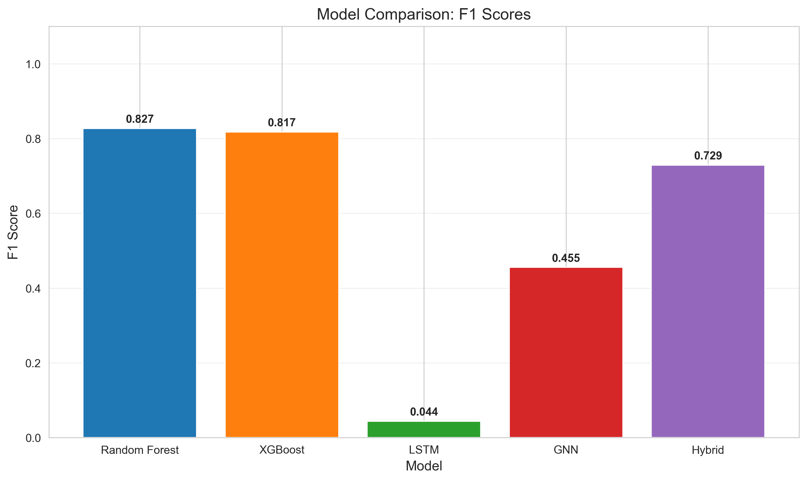
*Figure 1: F1 Score comparison across all models in the system*

### 7.2 Module 1: Multi-Model Classification Layer

**Random Forest Classifier** — An ensemble of 200 decision trees with class-weight balancing to handle the imbalanced fraud-to-licit ratio. Achieves the highest individual F1 score of **0.8269**.

**XGBoost Classifier** — Gradient-boosted decision trees (200 estimators, max depth 6, scale_pos_weight=10) optimized for imbalanced classification. Achieves F1 = **0.8174**.

**Isolation Forest** — Unsupervised anomaly detector that isolates outliers in feature space, producing anomaly scores converted to fraud probabilities.

**LSTM Temporal Model** — A 2-layer Long Short-Term Memory network (hidden_dim=64) processes 5-step transaction sequences to capture temporal fraud patterns.

**Graph Convolutional Network (GCN)** — A 2-layer GCN (hidden_dim=64) operating on the directed payment-flow graph, propagating fraud signals through the transaction network topology.

### 7.3 Module 2: Hybrid Risk Scoring Engine

The engine computes a weighted fusion of all model scores:

$$\text{FinalScore}(x) = \sum_{i=1}^{5} w_i \cdot S_i(x)$$

where $S_i(x)$ is the fraud probability from model $i$ and $w_i$ are dynamic weights computed based on per-model confidence and recency. The engine also incorporates blockchain state features (gas price, transaction volume) as contextual modifiers.

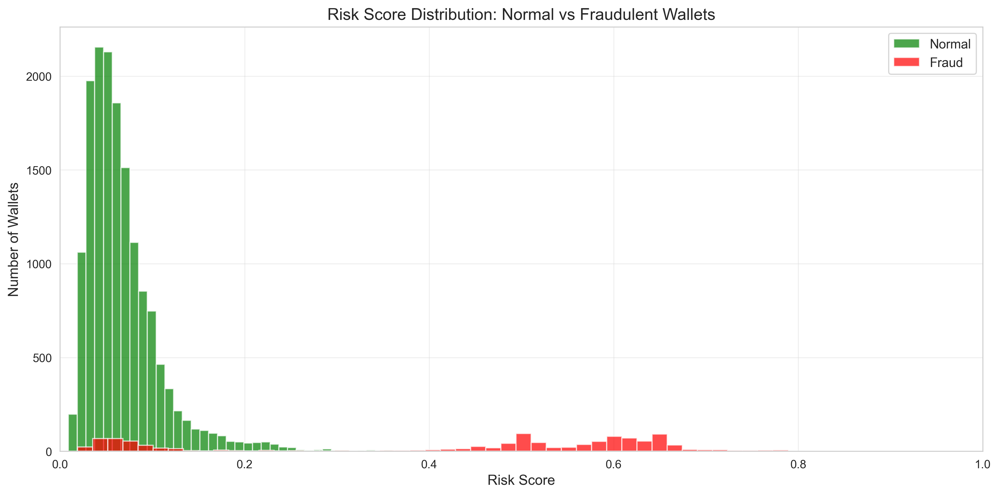
*Figure 2: Distribution of hybrid risk scores for normal vs. fraudulent transactions*

### 7.4 Module 3: Adaptive Threshold with HMM Regime Detection

A Hidden Markov Model with 3 hidden states is trained on historical price data to detect market regimes:

| Regime | Threshold | Rationale |
|--------|-----------|-----------|
| Bull Market | 0.40 | Lower threshold — fraud easier to hide in high volume |
| Bear Market | 0.60 | Standard threshold — normal activity levels |
| Volatile Market | 0.75 | Higher threshold — reduce false alarms during turbulence |

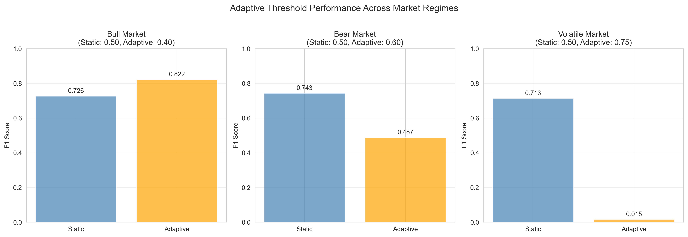
*Figure 3: Static vs. adaptive threshold F1 scores across market regimes*

### 7.5 Module 4: Behavioural Fingerprinting (GMM)

A Gaussian Mixture Model (4 components) clusters transactions into behavioural archetypes. Each transaction receives a fingerprint vector (cluster membership probabilities), which is appended to the feature set. This enables detection of recurring fraud patterns that may not be captured by individual feature analysis.

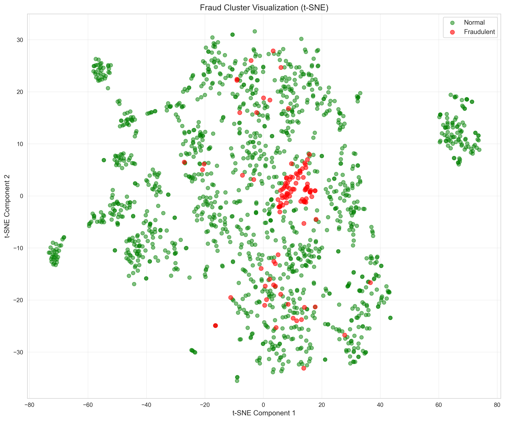
*Figure 4: t-SNE visualization of fraud vs. normal transaction clusters*

### 7.6 Module 5: Explainable AI with SHAP

For every flagged transaction, SHAP (TreeExplainer on XGBoost) decomposes the prediction into per-feature contributions, producing:
- A ranked list of the top contributing features
- A human-readable explanation string for compliance analysts

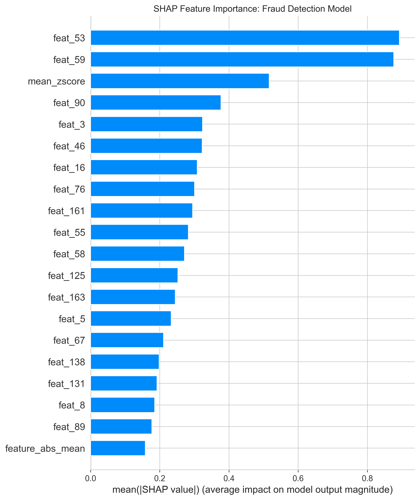
*Figure 5: SHAP-based feature importance for fraud detection*

### 7.7 Module 6: Graph Neural Network & Network Analysis

The GCN operates on a directed graph where nodes represent transactions and edges represent payment flows. Node features (178 dimensions) are propagated through 2 convolutional layers with ReLU activation and dropout.

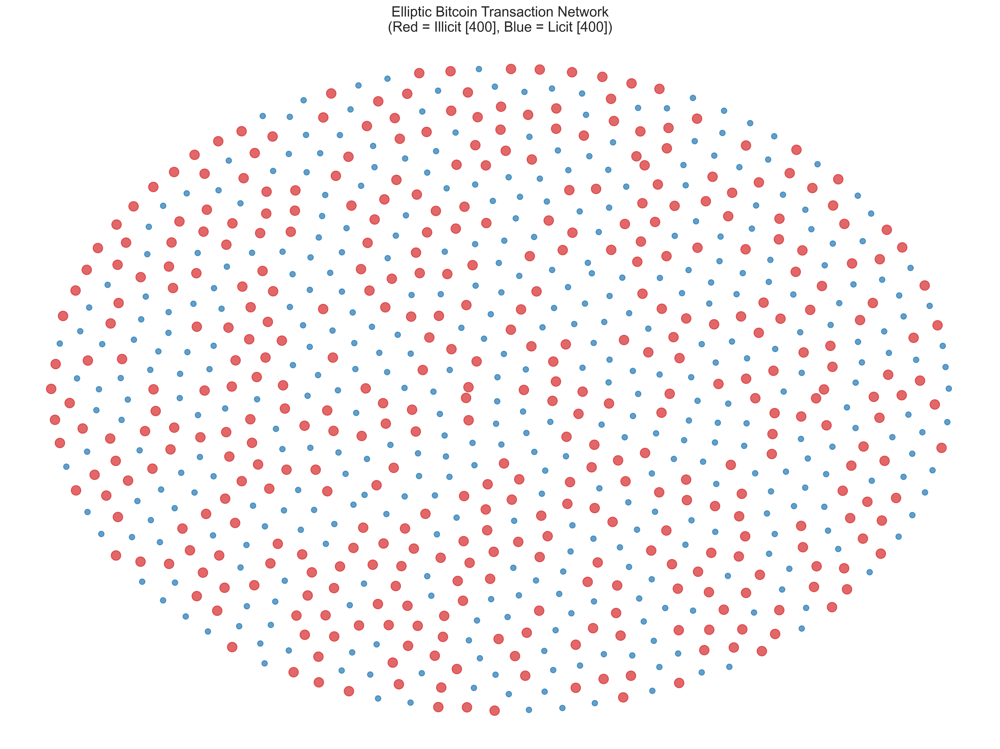
*Figure 6: Transaction network — Red nodes indicate illicit, Blue nodes indicate licit*

### 7.8 Module 7: LSTM Temporal Pattern Detection

The LSTM processes sliding windows of 5 consecutive transactions to capture temporal anomalies. Two-layer architecture with dropout and sigmoid output produces per-sequence fraud probabilities.

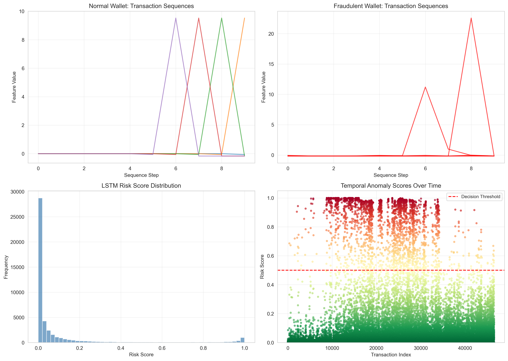
*Figure 7: LSTM temporal pattern analysis — normal vs. fraudulent sequences, risk score distribution, and anomaly scatter*

### 7.9 Module 8: Feature Importance Analysis

Random Forest feature importance identifies the most discriminative features for fraud detection:

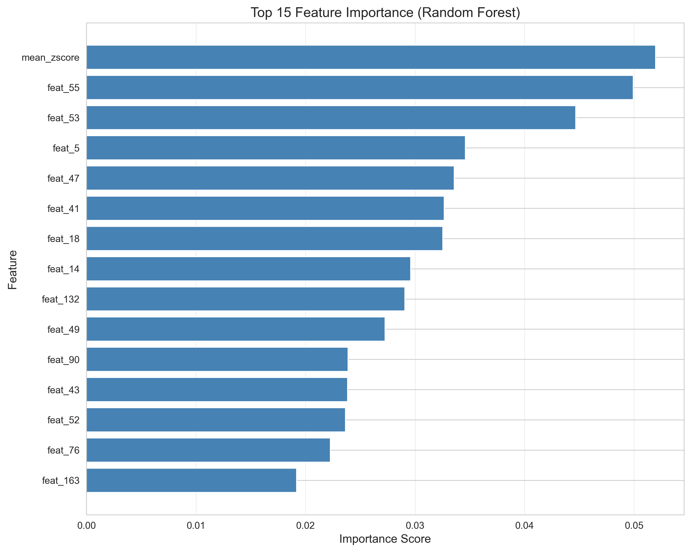
*Figure 8: Top 15 most important features for fraud classification (Random Forest)*

### 7.10 Module 9: RL-Based Policy Learning (DQN Agent)

A Deep Q-Network agent learns an optimal fraud-flagging policy through interaction with a custom Gym-style environment:

- **State space**: 183 dimensions (178 transaction features + 5 model scores from RF, XGBoost, Isolation Forest, LSTM, GNN)
- **Action space**: 2 discrete actions (flag as licit / flag as illicit)
- **Reward structure**: +1 correct classification, −2 missed fraud (false negative), −1 false alarm (false positive)
- **Architecture**: 3-layer MLP (256 → 128 → 2) with ReLU, experience replay (buffer=10000), ε-greedy exploration (1.0 → 0.01)

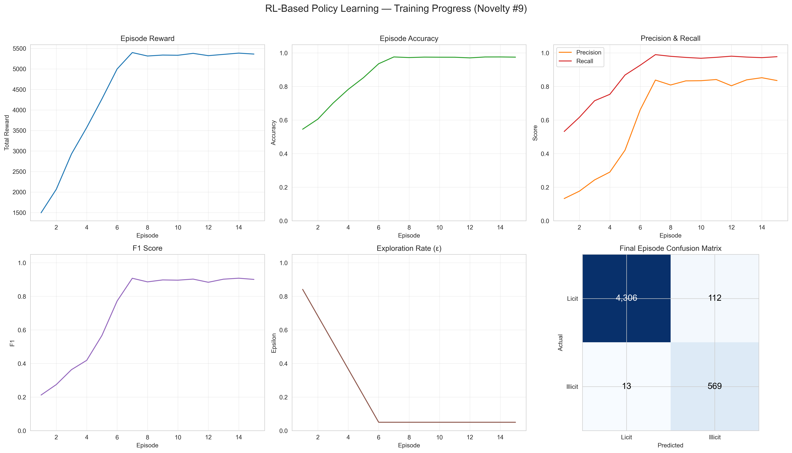
*Figure 9: RL agent training — episode reward, accuracy, precision/recall, F1, exploration decay, and final confusion matrix*

### 7.11 Module 10: Federated Learning (FedAvg)

Privacy-preserving distributed training is achieved through Federated Averaging:

- **Architecture**: 4 simulated exchange nodes, each holding a temporal partition of the training data
- **Local model**: 3-layer MLP with BatchNorm (input → 128 → 64 → 1) trained locally for 3 epochs per round
- **Aggregation**: Weighted FedAvg based on node dataset sizes across 10 communication rounds
- **Privacy**: Raw transaction data never leaves its originating node

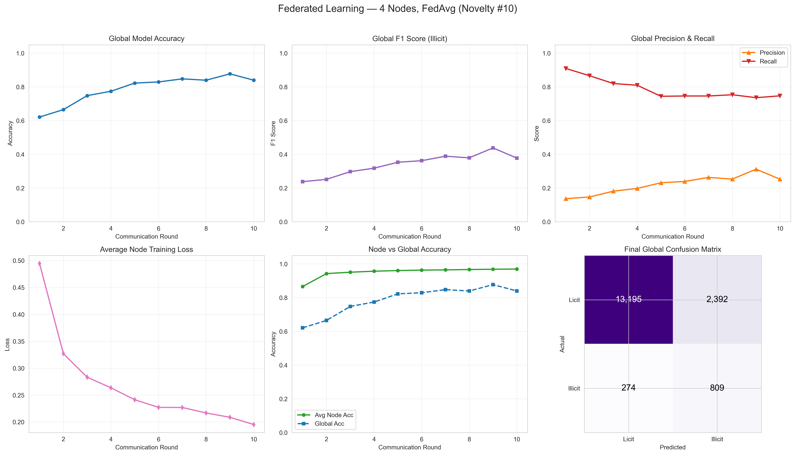
*Figure 10: Federated learning — global accuracy, F1, precision/recall, loss convergence, node vs. global accuracy, and final confusion matrix*

---

## 8. Experimental Validation Results

### 8.1 Overall System Performance

| Metric | Value |
|--------|-------|
| ROC-AUC Score | **0.8843** |
| Overall Accuracy | **97.23%** |
| Weighted F1 Score | **0.9687** |

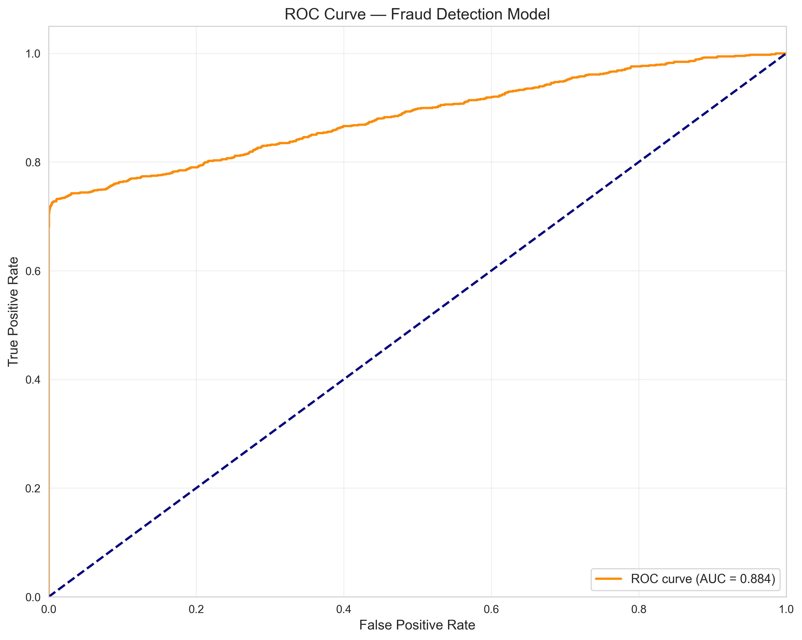
*Figure 11: ROC curve of the hybrid fraud detection model (AUC = 0.884)*

### 8.2 Individual Model F1 Scores

| Model | F1 Score | Description |
|-------|----------|-------------|
| Random Forest | **0.8269** | Ensemble of 200 decision trees |
| XGBoost | **0.8174** | Gradient-boosted trees (200 estimators) |
| RL-DQN Agent | **0.7978** | Deep Q-Network policy learner |
| Hybrid Engine | **0.7289** | Weighted fusion of all models |
| GNN (GCN) | **0.4553** | 2-layer Graph Convolutional Network |
| Federated Global | **0.3777** | FedAvg across 4 distributed nodes |
| LSTM | **0.0439** | 2-layer temporal sequence model |

### 8.3 Confusion Matrix — Hybrid Model

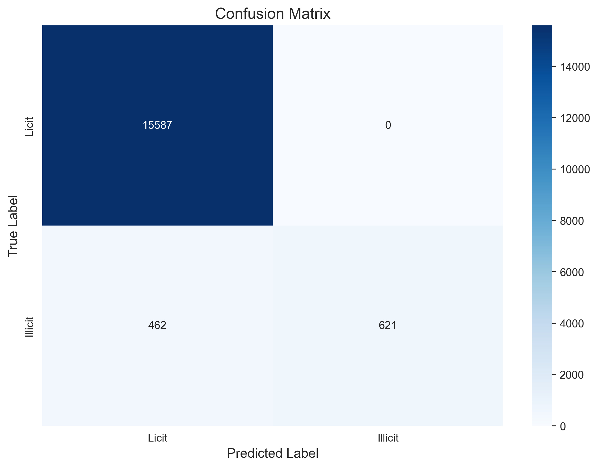
*Figure 12: Confusion matrix of the final hybrid model*

| Class | Precision | Recall | F1 Score |
|-------|-----------|--------|----------|
| Licit (class 0) | 0.971 | 1.000 | 0.985 |
| Illicit (class 1) | 1.000 | 0.573 | 0.729 |

### 8.4 RL Agent Performance

| Metric | Value |
|--------|-------|
| Accuracy | **0.9760** |
| Precision | **0.8816** |
| Recall | **0.7285** |
| F1 Score | **0.7978** |
| ROC-AUC | **0.8851** |

The RL agent achieves a higher F1 than the hybrid engine (0.7978 vs. 0.7289) by learning to optimally balance detection sensitivity against false-alarm cost through reward-shaped training.

### 8.5 Federated Learning Performance

| Metric | Value |
|--------|-------|
| Global Accuracy | **0.8401** |
| Global Precision | **0.2527** |
| Global Recall | **0.7470** |
| Global F1 Score | **0.3777** |
| Communication Rounds | 10 |
| Participating Nodes | 4 |

The federated model achieves **46.2%** of the centralized XGBoost F1 performance while ensuring that no raw transaction data is shared between nodes — demonstrating a viable privacy-accuracy trade-off for multi-exchange deployments.

### 8.6 Generated Artifacts

| Category | Count | Files |
|----------|-------|-------|
| Trained Models | 8 | RF, XGBoost, Isolation Forest, LSTM, GNN, RL-DQN, Federated Global, Scaler |
| Result Visualizations | 13 | ROC, Confusion Matrix, Risk Distribution, Feature Importance, Model Comparison, Network Graph, Temporal Patterns, SHAP, Fraud Clusters, Adaptive Threshold, RL Training, FL Curves |
| Processed Data Files | 3 | Train data, Test data, Graph data |

---

## 9. Aspects of the Invention Requiring Protection

1. **Hybrid Multi-Model Dynamic Risk Scoring Engine** — The method of fusing fraud probability scores from five heterogeneous classifiers (tree-based, sequential, graph-based, unsupervised) using dynamically computed weights with blockchain-state contextual modifiers.

2. **Adaptive Threshold Classification via HMM Market Regime Detection** — The technique of using a Hidden Markov Model to automatically detect market regimes (bull/bear/volatile) and dynamically adjust classification thresholds to optimize fraud detection under varying market conditions.

3. **Behavioural Fingerprinting using GMM Clustering** — The process of constructing per-transaction behavioural fingerprint vectors via Gaussian Mixture Model cluster membership probabilities, and integrating these fingerprints into the feature space for downstream classification.

4. **RL-Based Optimal Fraud-Flagging Policy with Asymmetric Reward Shaping** — The method of training a Deep Q-Network agent on a composite state (transaction features + multi-model scores) with an asymmetric reward function (−2 for missed fraud, −1 for false alarm, +1 for correct) to learn an optimal flagging policy that outperforms static fusion.

5. **Federated Averaging for Privacy-Preserving Multi-Exchange Fraud Detection** — The architecture enabling multiple cryptocurrency exchanges to collaboratively train a shared fraud detection model via FedAvg aggregation without any exchange sharing its raw transaction data.

6. **Integrated Explainability Pipeline** — The end-to-end method of coupling SHAP-based per-feature explanations with the hybrid scoring engine to produce human-readable, auditable justifications for every fraud flag, supporting regulatory compliance.

7. **End-to-End Modular Pipeline Architecture** — The complete system architecture integrating all ten modules (feature engineering, RF, XGBoost, Isolation Forest, LSTM, GCN, hybrid scoring, adaptive threshold, RL policy, federated training) into a single deployable pipeline with standardized interfaces between modules.

---

*Document generated from experimental results. All figures reference outputs produced by the implemented system.*
